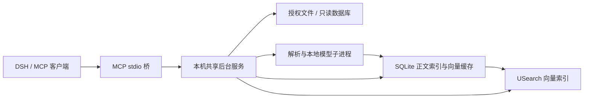

# one_search

面向 DSH Agent 等 MCP 客户端的本地文件与数据库检索插件。当前交付单机版：共享后台服务、MCP stdio 桥，以及安装/升级/卸载脚本。索引和语义计算留在本机。

GitHub 项目名为 `one_search`；当前 Python 包名 `data_search`、命令及 MCP 配置名 `data-search` 保持兼容。

先阅读 [本机验证报告](docs/VALIDATION.md)。Windows 已完成单机闭环验证；Linux、PostgreSQL 16/18、几百 GB 正文的完整索引和真实多机接入尚未实测。

## 已实现的能力

- 文件名、路径、扩展名、大小和修改时间。先发现文件，再逐步解析正文。
- 关键词、本地 BGE 语义及混合检索，返回路径、正文片段、定位、索引时间和过期状态。
- SQLite、MySQL、PostgreSQL 只读结构发现、受控查询，以及选定文本字段的本地快照索引。
- 文件变更监听，默认每 180 秒处理增量、每小时目录核对；暂停/恢复、重启后核对、模型闲置释放。
- 查询和结果包含 `node_id`、`source_id`，保留多机扩展协议。当前只接受本节点，远程节点明确返回尚未实现。

正文支持 TXT/Markdown/LOG、常见代码和配置、JSON/JSONL、XML、HTML、CSV/TSV、DOCX、XLSX、PPTX、文字层 PDF。详细内容、定位、编码和排除类型见 [文件格式说明](docs/FORMATS.md)。图片/OCR、音视频、压缩包内部、旧版 DOC/XLS/PPT 不属于本版正文能力。

数据库需要提供的地址、账号、密码环境变量、授权表/字段、稳定唯一标识和文本索引设置，见 [数据库说明](docs/DATABASES.md)。正文快照默认每个数据源最多 1,000 条，达到上限显示覆盖不完整；精确结构化查询直接访问授权数据库。

## 安装与接入

需要 Python 3.11+；Windows 发行 ZIP 包含 Python 3.11 的依赖 wheel。模型约 24 MiB，首次安装下载，也可指定已准备的离线模型目录。此版本尚未打包 Python 运行时。

源码安装（PowerShell，替换为明确允许检索的目录）：

```powershell
.\scripts\install.ps1 -Root 'D:\资料'
```

安装器创建隔离环境，安装服务，准备模型，配置当前用户登录自启动，启动服务，并生成 `<InstallDir>/mcp.json`。将其中条目加入 DSH 或其他宿主的 MCP 配置即可。离线安装、Linux、暂停/恢复和卸载见 [安装说明](docs/INSTALL.md)。本版没有改写未知版本 DSH 的设置。

开发环境和合成资料试用：

```powershell
python -m venv .venv
.venv\Scripts\python.exe -m pip install -e '.[dev]'
.venv\Scripts\python.exe scripts/create_demo.py --output .demo
.venv\Scripts\data-search.exe init --config .runtime\demo\config.json --data-dir .runtime\demo --root .demo\files
.venv\Scripts\data-search.exe model-download --config .runtime\demo\config.json
.venv\Scripts\data-search.exe start --config .runtime\demo\config.json
.venv\Scripts\data-search.exe search '服务器费用怎么降低' --config .runtime\demo\config.json --mode hybrid
```

将 `.demo/database_config.json` 中的 SQLite 对象加入主配置 `databases` 后重启，可检索合成数据库。不要把参考答案或评估报告目录纳入文件索引。

## MCP 接口

| 工具 | 用途 |
|---|---|
| `search` | 文件名、关键词、语义、混合检索，可选数据源和扩展名 |
| `fetch` | 读取命中上下文；文件为带过期标记的索引快照，数据库按标识实时读取 |
| `inspect_source` | 查看授权目录、数据源、表和字段 |
| `query_database` | 结构化过滤、排序、分页、有限关联及聚合，不接受任意 SQL |
| `index_status` | 覆盖、进度、资源、失败原因 |

`id=c:...` 从命中片段开始分页；`document_id=d:...` 从文档开头分页。向量分数只用于排序，不代表资料一定能回答问题。语义检索先取有限近邻再按数据源/扩展名过滤，过滤可能导致漏召回，结果会提示；关键词检索在排序前应用过滤条件。

DSH 聊天模型负责理解问题、调用工具、引用证据并回答。本地 embedding 模型把查询/正文转成向量。本版不调用 DSH 聊天模型生成向量，也不上传正文做语义计算。返回给 DSH 的内容之后如何处理，仍取决于宿主自身配置。

## 资源配置

| 设置 | 默认值 |
|---|---|
| 后台索引任务 / 模型计算线程 | 1 / 1 |
| 进程树 RSS 预算 / 可用内存门槛 | 1,024 / 768 MiB |
| 索引与模型磁盘预算 / 最低剩余磁盘 | 10,240 / 1,024 MiB |
| 单文件正文上限 / 字符上限 | 32 MiB / 200 万字符 |
| 单文件解析超时 / 模型闲置释放 | 30 / 120 秒 |
| 增量处理 / 完整目录核对 | 180 / 3,600 秒 |

正文超出预算时保留可发现的文件名，并报告 `budget` 或 `partial`。更新时效是调度间隔加队列处理时间，积压时会超过几分钟。内存控制采用子进程隔离及约 100ms 采样，超预算终止 worker；这不是 OS 强制硬内存上限，瞬时峰值与系统文件缓存不由该数值保证。未设置硬 CPU 配额。

8GB 电脑适合先用小范围资料验证，保留系统可用内存并接受限速、暂停。500GB 磁盘容量不能决定索引空间或查询速度；文件数、可提取文本量、片段数和存储性能更关键。

实现采用 Python 控制服务、SQLite FTS5、USearch HNSW、ONNX Runtime。解析和模型使用可回收子进程；文件系统事件用于增量更新，未实现 NTFS MFT/USN 专用目录发现。



协议见 [接口说明](docs/CONTRACTS.md)。实测见 [验证报告](docs/VALIDATION.md)、[质量](docs/validation/quality.json)、[资源](docs/validation/resources.json)、[查询内核基准](docs/validation/benchmark.json)。
