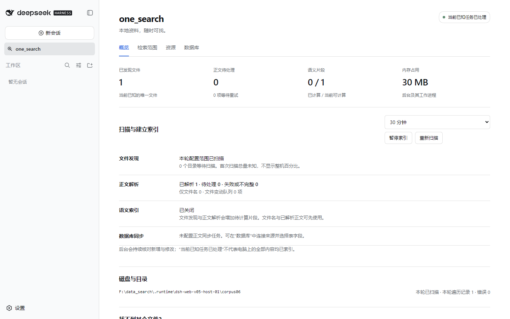
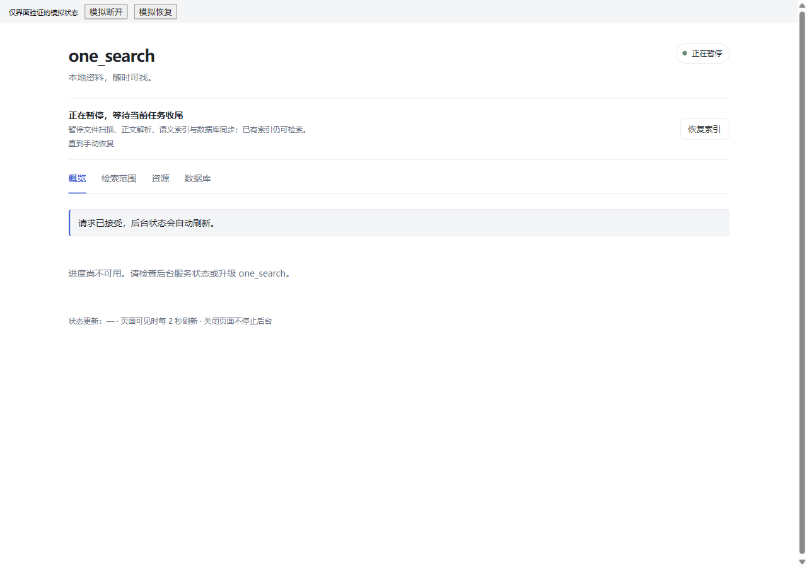

# DSH Web 设置与索引进度

安装入口仍是项目 [README](../README.md)。Web 面板负责安装后的设置和日常观察。建议后台与 DSH bundle 成套升级到 v0.5.2；新 bundle 仍兼容 v0.5.0 后台，以支持失败回滚后恢复连接，但完整暂停能力需要 v0.5.2 后台。首次从旧 bundle 迁移时，按 [升级说明](UPGRADE.md) 先停止对应宿主连接，再安装和重新注册。

## 打开

启动已注册插件的 DSH Web profile，点击侧栏 **one_search**。主区域出现概览、检索范围、资源、数据库四个页签。浏览器使用 DSH 的已认证连接，由 DSH 所在机器访问 one_search；不需要新增浏览器端口，也不把后台 bearer token 发给页面。

本轮验收以本机 DSH Web 为目标。远程浏览器使用相同的服务端桥接设计，但 SSH、LAN 和远程部署的实际支持范围需单独验证。面板填写的文件和模型路径属于服务所在机器。

## 看懂进度

各阶段可以同时推进：

| 区域 | 含义 |
|---|---|
| 文件发现 | 当前已知唯一文件数、各根目录的扫描状态、累计遍历记录及待扫描目录；遍历记录可能包含断点恢复后的重复经过 |
| 正文解析 | 已完成、部分完成、不支持、失败及受预算限制的文件；待处理队列包含正在等待退避重试的任务 |
| 语义索引 | 已编码片段 / 已知可处理片段；向量发布可能仍在排队，编码完成不等于全部可检索 |
| 数据库 | 当前来源、表、全量或增量阶段，以及已处理行/页；为展示进度不会额外全表 COUNT |
| 资源 | 后台及其子进程 RSS、系统可用内存、索引与模型空间；系统 CPU 指整机负载，不是插件自身 CPU |

首次全盘发现没有可靠总量，所以不给全机完成百分比或预计剩余时间。“当前已知任务已处理”也不表示磁盘所有文件都能读取：排除、无权限、不支持、大小预算及尚未发现的资料仍可能形成覆盖缺口。新资料加入后语义比例下降属于分母扩大。

可见页面约每 2 秒刷新，隐藏和关闭后停止轮询。后台覆盖统计缓存最多 5 秒，磁盘占用定期校准。网络中断时保留最近一次数据并提示更新时间，不能将旧数据当作实时成功状态。

## 调整设置

1. 首次安装默认当前服务账户的文档目录。在检索范围中可改选整机或指定目录，修改排除项和正文/语义范围；升级保留已有选择。
2. 在资源页选择档位及空闲、电源策略。档位改变调度预算，不自动缩小检索范围。
3. 预览范围影响并保存。范围预览只检查有界数量的已知文件，不承诺预测全部新文件。
4. 等待“已保存并应用”反馈；后台会应用配置并重启，暂停状态继续保留。

表单不被后台轮询覆盖，面板内四个页签之间切换会保留编辑。切换到聊天等其他主面板前请先保存；未保存草稿不作为跨面板持久存储。若另一个页面先修改设置，保存会返回版本冲突；重新读取后再合并修改。预检失败时原配置保持不变。重启失败会尝试恢复原配置；如果页面断线或保存超时，先重新读取设置与服务状态，再决定重试，避免重复提交仍在进行的事务。

## 数据库

支持 SQLite、MySQL、PostgreSQL。SQLite 填写文件绝对路径；网络数据库填写主机、端口、库名、只读账号，并选择系统凭据或密码环境变量。页面只保存凭据引用，不读取或回显密码。

先发现结构，再逐表勾选允许读取的字段。需要正文索引时，额外选择文本字段及稳定单列唯一键；水位字段只有在源系统每次新增/更新都会维护时才选择。无稳定键的表保留实时查询。发现表并不自动授予检索权限，候选配置通过只读测试并保存后才生效。

完整限制见 [数据库说明](DATABASES.md)。已有高级选项在普通设置编辑中保留；页面没有展示的原始配置和凭据不会被返回浏览器。

## 日常控制

- 四个页签上方常驻“暂停索引 / 恢复索引”按钮，默认暂停直到手动恢复，也可选 15 分钟、30 分钟或 1 小时。暂停阻止文件发现、正文解析、语义编码/向量发布和数据库索引同步；已索引资料继续可搜索，只读实时数据库查询仍可用。
- “正在暂停”表示在途任务尚在收尾，“已暂停”表示后台扫描/向量任务已退出。任务游标和待处理队列保留，恢复后继续；暂停不会被计为失败或触发退避。重启服务仍保留暂停及定时截止点。显式文件刷新和独立模型下载/导入需分别控制。
- 服务断开时按钮保持可见但禁用，显示暂停状态待确认；旧状态不能证明后台已停止。连接恢复后页面自动更新，首次读取失败的设置会重试，已编辑草稿保留。
- “重新扫描”安排扫描任务。暂停期间会排队，恢复后执行。
- “诊断路径”用于解释指定路径的范围、发现、解析和索引缺口。“刷新此路径”可以处理目标文件，语义工作仍遵守后台策略。
- 模型失败可重试或从服务机器的离线目录导入；取消模型准备不会关闭文件名和关键词检索。
- 关闭面板或切到聊天页只停止页面轮询，后台服务继续运行。

以下截图来自真实浏览器中的 React 界面验收夹具，使用模拟后台状态验证布局与交互；实际 DSH/后台连接需另行验收。验证记录见 [Web 控制验收](validation/web-controls-v0.5.2.json)。

## 连接错误诊断

错误提示显示 `错误码 + 说明 + 处理建议`。这里的“本地服务”指 **运行 DSH 服务端的电脑/服务器**，不是打开网页的电脑。遇到远程服务器问题，应在该服务器按 [安装诊断](INSTALL.md) 检查同一 InstallDir/DataDir，并记录页面错误码、发生时间、插件/后台版本及 `installation-status`、`status`、后台日志。

| 错误码 | 含义与处理 |
|---|---|
| `configuration_missing` / `configuration_unreadable` / `configuration_invalid` | 检查 DSH 的 configPath、配置 JSON 和运行账户权限 |
| `service_state_missing` / `service_state_unreadable` / `service_state_invalid` | 检查后台是否启动、数据目录权限及启动日志 |
| `service_connection_refused` | 状态记录存在但端口没有接受连接，检查后台是否退出 |
| `service_connection_timeout` / `service_disconnected` | 响应超时或中途断开，检查负载、重启和后台日志 |
| `service_identity_mismatch` / `service_auth_rejected` | 检查当前配置与数据目录是否一致；刚重启时页面会重读状态 |
| `service_busy` / `service_stopping` | 等待已有请求或后台重启完成 |
| `service_response_invalid` / `service_endpoint_rejected` / `service_response_too_large` | 核对后台/插件版本，提供错误码给维护者 |
| `backend_rejected` / `backend_operation_failed` | 检查操作参数、数据源可访问性和后台日志 |
| `host_starting` / `host_startup_failed` | 检查 DSH 的插件启动日志；失败后修复安装并重新加载 profile |

状态检查不会循环启动后台或重放写操作；仅在发现服务身份确实已更换时，重试一次只读状态查询。不要因通用连接失败直接删除配置、索引、升级标记或快照。

## 升级期间

Windows 原生后台升级支持与 v0.5.1 及更新兼容 DSH bundle 协调。参与连接的所有 profiles 都已更新时，DSH Web 页面可以保持打开：面板显示维护/升级状态，管理操作返回 `upgrade_in_progress`，当前搜索工具会暂时断开。安装器等待已经接受的管理操作实际结束，避免保存设置尚未完成就替换运行时；升级健康检查或成功回滚后，工具自动重新注册，页面随后刷新状态。

页面可见不表示升级已完成。待安装器返回结果、面板恢复后台状态后，再调用 `index_status` 和一次 `search` 验证连接。如果升级进程中断，页面继续显示维护态；保留维护标记和快照，重跑同一安装器恢复。不要通过删除 `<DataDir>/upgrade-state.json` 解除维护。

从 v0.5.0 或更旧的 bundle 首次升级，仍需停止 DSH 服务端/profile；只关闭浏览器标签页无效。`Settings.vbs` 打开的原生设置窗口也占用 runtime，须先关闭。Windows bootstrap 和 Linux 升级仍采用停止宿主、停止后台后重装的流程。更新 DSH bundle 本身后，应重新注册并重启相应 profile 使新代码生效。完整命令见 [升级说明](UPGRADE.md)。
