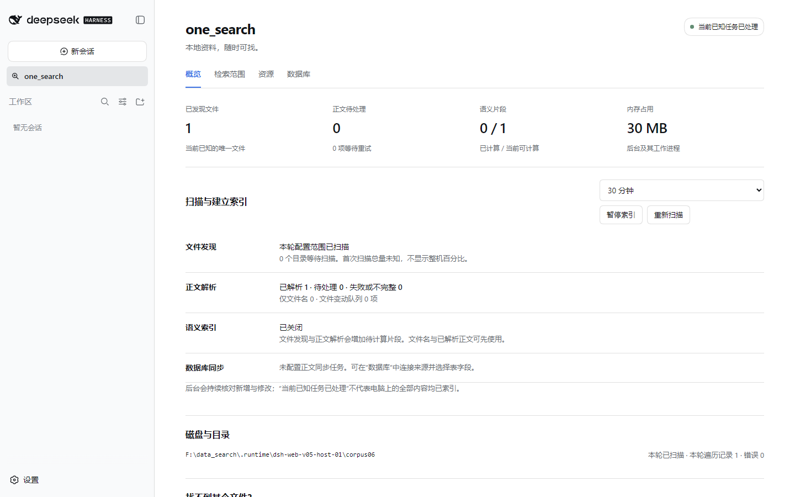

# v0.5 单机与 DSH Web 验证报告

v0.5 为 DSH Web 增加侧栏设置入口和真实索引进度。本轮在 Windows、本机 DSH 和隔离合成资料上执行；未扫描用户整台电脑。v0.4 的数据库、检索质量、资源与性能证据保留在 [历史报告](VALIDATION-v0.4.md)，这些数据没有被当作 v0.5 的新测量。

## 回归

[本机测试记录](validation/tests-v0.5.json)：Python **489 passed / 5 skipped**，55.99 秒；Node **39 passed / 0 failed**。Python 跳过一个非 Windows 分支，以及四项需要单独配置的真实 MySQL/PostgreSQL 测试。新增覆盖真实后台的保存重启、预检失败、并发版本冲突、写入失败和启动失败恢复、暂停期限保留，以及 Tk 与 Web 共同编辑的版本检查。

[双平台 CI](validation/ci-v0.5.json) 已通过：Windows 488 passed / 6 skipped，Node 39/39；Ubuntu 24.04 469 passed / 25 skipped，Node 36 passed / 3 skipped。Windows CI 比本机多跳过一个缺少控制台入口的测试；本机安装验收覆盖该入口。Ubuntu 另外通过无界面安装、重复安装、索引迁移和卸载流程；未启用 systemd 自启动或 Linux 语义模型。

## 真实 DSH Web 与浏览器

[Web 验收记录](validation/web-v0.5.json)：已安装 DSH CLI 0.1.5-rc.1、Web/client 依赖 0.1.5-rc.2，独立 DSH home/profile，未改用户默认 profile、未调用聊天模型。最终 bundle 重新 staging 后再次加载成功。

Playwright 在 1440×900 和 740×700 检查界面，实际完成侧栏进入四页、暂停/恢复、目录范围预览和保存、资源档位持久化、路径诊断和刷新、SQLite 发现结构与逐列授权、正文索引及两行同步进度。另一窗口抢先保存时，浏览器收到冲突且保留草稿；确认放弃后能读取最新配置。后台停止时出现过期状态提示，恢复后重新连接。

可见面板 4.5 秒观察到至少两次状态请求；切回聊天页后观察 4.5 秒没有状态请求；重新打开后恢复请求。隐藏标签的调度另有状态单元测试，此项不冒充所有浏览器节流策略下的实测。

首轮发现不显示未知全机总量的百分比。已知唯一文件、遍历记录、正文队列、语义片段、向量发布和数据库阶段分别报告；“当前已知任务已处理”不声称全机所有内容均已覆盖。

HTTP 实测未认证返回 401，跨来源、跨站与伪造 Host 返回 403，错误路径 404，错误方法 405，非法 JSON/信封 400，超大声明长度及 chunked 请求 413。应用参数超过 128KiB 在执行前拒绝，任意命令和原始 SQL 操作不开放。页面不获得后台 bearer token。无 Web 的 DSH profile 仍发现 11 个 MCP 工具并成功调用状态与检索。两套测试宿主及后台均已正常退出。

当前 DSH 的 `connection.rpc.handle` 存在未声明服务访问问题，因此插件使用正式 `webServer.register` 加 `connection.requestRejection` 承载相同 RPC 格式，没有修改宿主程序。

## Windows 安装与升级

[安装报告](validation/install-v0.5.json) 对应 candidate-1 的原生程序与 wheel 哈希。原生基础安装约 10.906 秒，bootstrap 约 37.484 秒；两种 ZIP 均实际验证全新安装、重复安装、离线模型、语义查询、11 个 MCP 工具、索引迁移、保留数据卸载重装及受管数据清理。两包都通过 `web-manage` 标准输入的读取、范围/档位保存、重启、进度与过期版本拒绝。

真实 v0.4 → v0.5 升级保留配置、索引与文档身份；强制新 daemon 启动失败时恢复旧程序、原配置及可用查询。安装测试实例已清理。最终打包步骤刷新文档和插件，并复核已验收 native/wheel 未变、运行时代码与提交内容一致及逐文件校验和；发行附带六个资源文件。

## 尚未实际验收

- 物理 8GB/16GB 电脑、真实数百 GB 资料和小时/天级连续运行。
- LAN/SSH 等远程浏览器部署、多机接入与联合检索。
- 本轮 Web 页面连接真实 MySQL/PostgreSQL、Web 点击模型下载/导入；已有适配器、CLI 与安装包验证不能替代这些完整页面路径。
- 所有浏览器、DPI 和目标服务器；Linux 桌面密钥环、systemd 用户会话和 Linux 原生包仍沿用历史边界。

模型缺失不影响文件名与关键词能力；若安装或服务启动在插件首次激活时失败，应先按 README 排障，不能保证面板本身成为冷启动修复入口。使用方法见 [DSH Web](DSH-WEB.md)，其余已有边界见 [v0.4 报告](VALIDATION-v0.4.md)。
